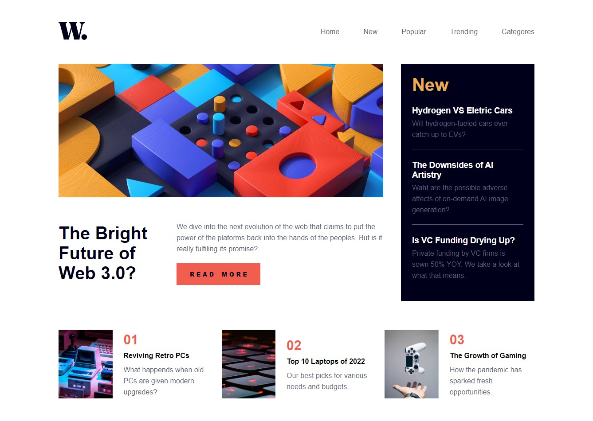
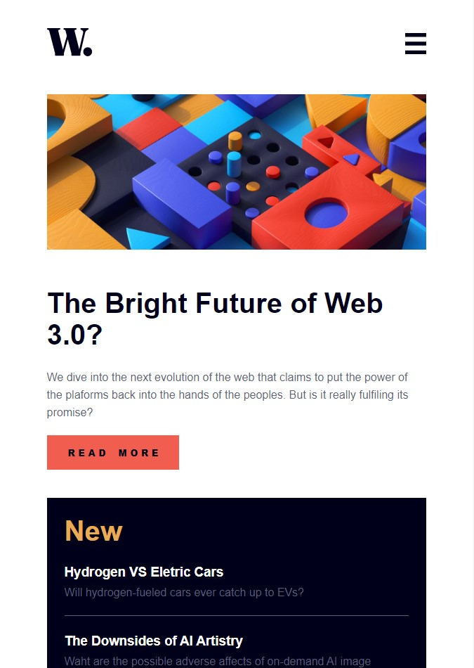
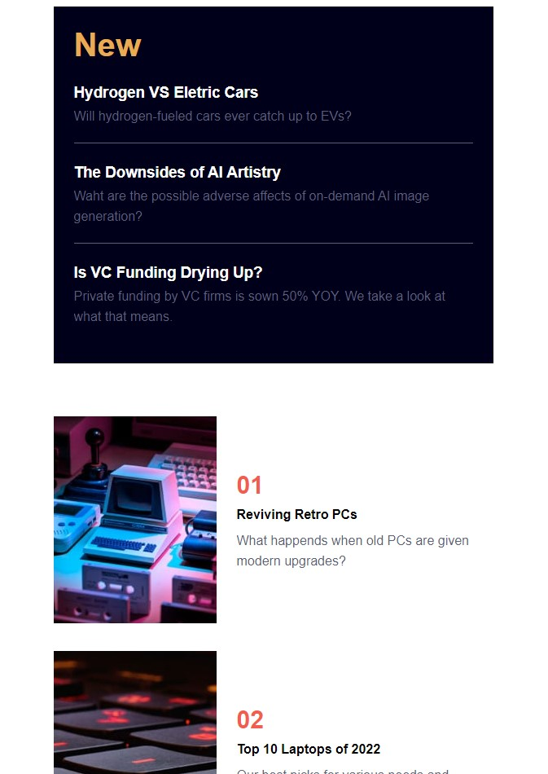
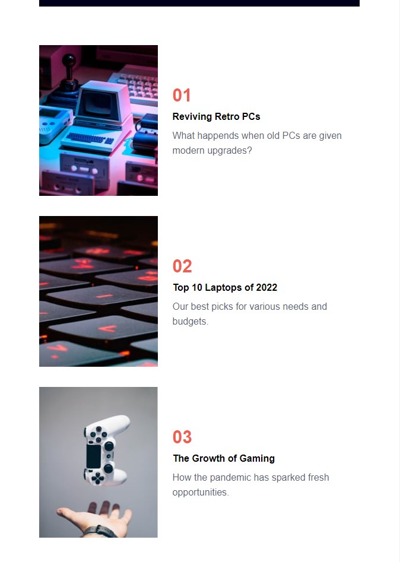

# Frontend Mentor - News homepage solution

This is a solution to the [News homepage challenge on Frontend Mentor](https://www.frontendmentor.io/challenges/news-homepage-H6SWTa1MFl). Frontend Mentor challenges help you improve your coding skills by building realistic projects. 

## Table of contents

- [Overview](#overview)
- [The Challenge](#the-challenge)
- [Screenshot](#screenshot)
- [Links](#links)
- [My Process](#my-process)
- [Built with](#built-with)
- [What I Learned](#what-i-learned)
- [Continuous Development](#continuous-development)
- [Author](#author)

## Overview

### The challenge

Users should be able to:

- View the optimal layout for the interface depending on their device's screen size
- See hover and focus states for all interactive elements on the page

### Screenshot

### Links

- Solution URL: (https://github.com/1IMperaDOR0/newshomepage.github.io)
- Live Site URL: (https://1imperador0.github.io/newshomepage.github.io/)

## My process

### Built with

- Markup languages ​​(HTML5 and CSS3)
- Semantic framework
- Flexbox and responsiveness
- Programming language (JavaScript)
- Interactivity

### What I learned

I used this challenge to reinforce the programming concepts I learned after a few days without contact, such as tags, responsiveness, javascript and github commands in cmd. I believe I did well. The only problem was using versioning in github, which was not actually applied. So I checked some articles that helped me better understand how this concept works. Here they are if you want to consult them: [About Release](https://docs.github.com/en/repositories/releasing-projects-on-github/about-releases) and [Managing Releases in a Repository](https://docs.github.com/en/repositories/releasing-projects-on-github/managing-releases-in-a-repository).

### Continued development

As I mentioned before, I didn't feel comfortable doing release versioning, so I intend, in addition to the articles seen, to do more projects that help me put into practice the knowledge acquired. In addition, I need to find challenges that require more manipulation of DOM elements through JavaScript to further develop my programming logic.

## Author

- Frontend Mentor - [@1IMperaDOR0](https://www.frontendmentor.io/profile/1IMperaDOR0)
- GitHub - [1IMperaDOR0](https://github.com/1IMperaDOR0)